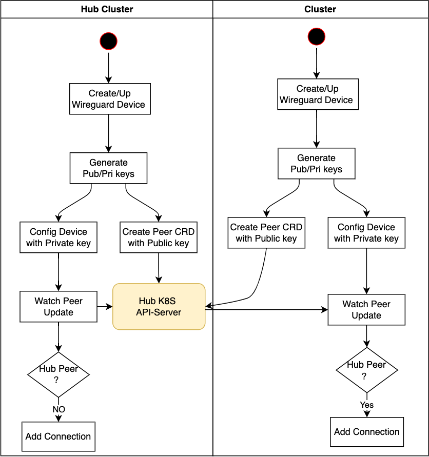
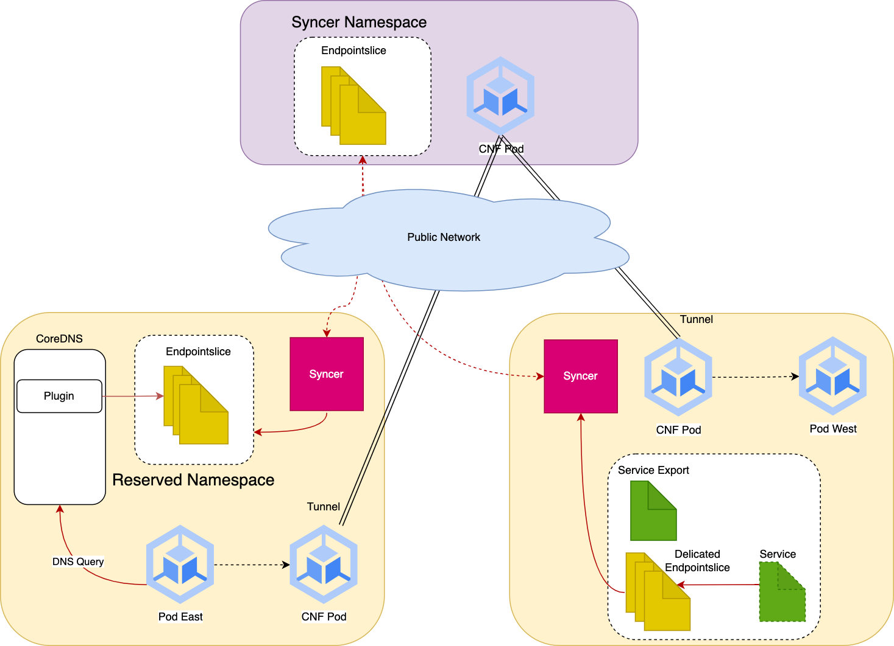
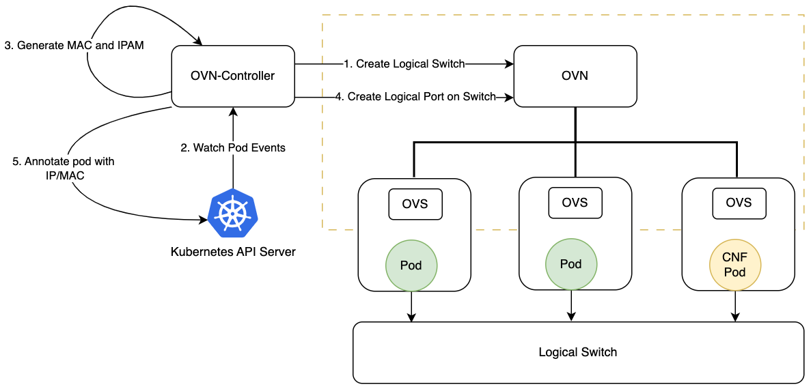

## ovn-builder

`ovn-builder` connects kubernetes clusters by a new build parallel network securely.
`ovn-builder` has no limits of cluster IP CIDR or CNI types of kubernetes clusters and also
provide service discovery ability.

It consists of several parts for networking between clusters:

- ovnmaster it builds an `ovs` for in-cluster traffic manage which is parallel with native cluster CNI and IPAM 
  for second network interface
- nri-controller add second network interface when pod created.
- syncer sync multi cluster services related resource across clusters
- octopus manages secure tunnels between hub and clusters
- crossdns provides DNS discovery of Services across clusters.

## Architecture


## Hub Cluster

We use hub cluster to exchange MCS related resources for connecting clusters, and establish secure tunnels with
all other participating clusters. Hub defines a set of ServiceAccount, Secrets and RBAC to enable `Syncer` and
`octopus`to securely access the Hub cluster's API.

## Octopus

Octopus maintains the tunnels by using of [WireGuard](https://www.wireguard.com/), a performant and secure VPN
in`CNF pod`. The `CNF pod` can run on any node without specifically designated. `CNF pod` will generate key pairs 
every time it starts, creates and up wiregurad network interface and config the wireguard device with `peer` CRD.


For develop guide, workflow show as.



## Syncer、Cross DNS

We may merge the two components into one Service Discovery Component.

For every service in cluster which has ServiceExport created for it. A new EndpointSlice will be generated to represent
the running pods contain references to endpoint's secondary IP. These endpointSlice resources will be exported to
`Hub Cluster` and will be copied to other clusters.



## OvnMaster

OvnMaster deploy `OVN/OVS` components to create a virtual switch for all pods’ secondary network, so that we can route
all inner cluster traffic to CNF pod in L2 level, without any specifically modification on Kubernetes Node.

Also, it creates logical switch, watches the Pod creation and deletion events, manage the address and create
logical ports. Finally, it writes the assigned address to the annotation of the Pod.




## Install by helm
- Hub
  ```shell
  helm repo add  mcs http://122.96.144.180:30088/charts/mcs
  helm install octopus mcs/octopus --namespace octopus-system  --create-namespace \
  --set image.repository=122.96.144.180:30080/octopus --set tunnel.endpoint=172.24.33.2 \
  --set tunnel.cidr=10.112.0.0/12
  ```
- Cluster
  ```shell
  1. helm repo add  mcs http://122.96.144.180:30088/charts/mcs
  2. helm install octopus mcs/octopus-agent --namespace octopus-system  --create-namespace \
  --set image.repository=122.96.144.180:30080/octopus --set hub.hubURL=https://121.41.31.123:6443 \
  --set tunnel.cidr=10.113.0.0/16 --set tunnel.globalcidr=10.112.0.0/12 --set hub.ca={{ index $secret.data "ca.crt" }} \
  --set hub.token={{ $secret.data.token }} 
  
  3. Add a pv. In some cases, there maybe cluster has no storage class, so we need create a pv bound to ovn-central.
  4. Recreate CNF pod and test pods.
  5. Edit coredns configmap, and restart coredns pods.
  ```
  
