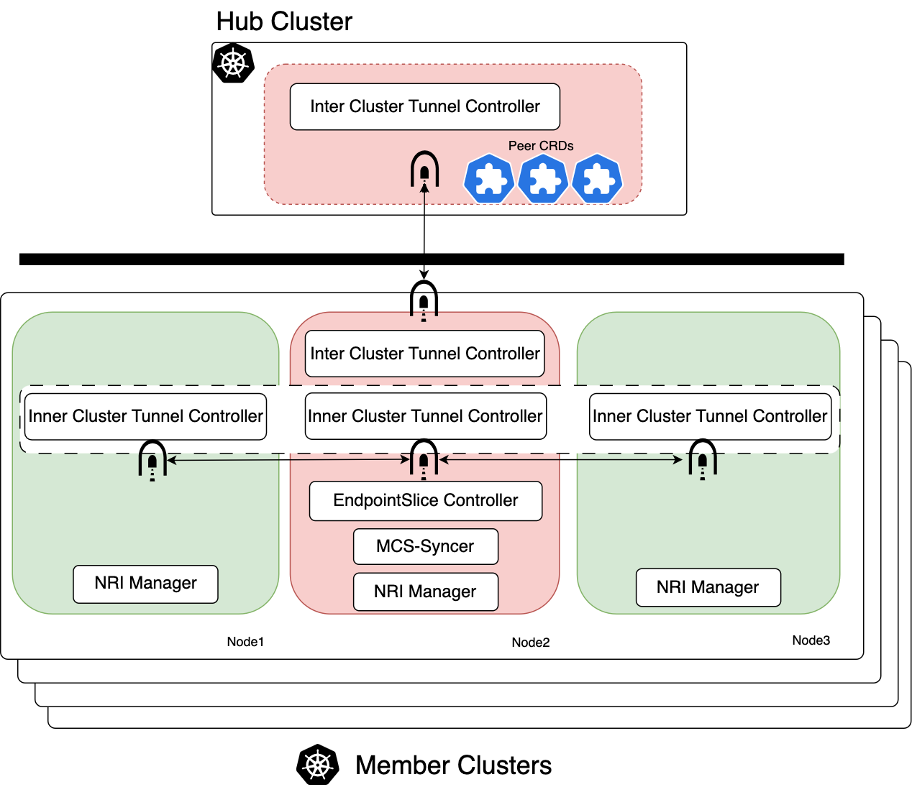

# FleetBoard

`Fleetboard` connects kubernetes clusters by a new build parallel network securely, it requires no public IP for
child cluster and has no limits of cluster IP CIDR or CNI types of kubernetes clusters and also
provide service discovery ability.

With ``Fleetboard``, you don't need to impose any specific requirements on the cluster or be aware of the cluster nodes. 
Additionally, there are no intrusive modifications to the cluster. All tunnels and network policies are configured 
within the containers.

It consists of several parts for networking between clusters:

- `cnf` adds second network interface for pods and establishes VPN tunnels across inner-cluster and inter-cluster.
- `crossdns` provides DNS discovery of Services across clusters.

## Architecture



## Hub Cluster

We use hub cluster to exchange MCS related resources for connecting clusters, and establish secure tunnels with
all other participating clusters. Hub defines a set of ServiceAccount, Secrets and RBAC to enable `Syncer` and
`cnf`to securely access the Hub cluster's API.

## Child cluster

For every service in the cluster that has a `ServiceExport` created, a new `EndpointSlice` will be generated to represent
the running pods and include references to the endpoint's secondary IP. These `EndpointSlice` resources will be exported
to the `Hub Cluster` and synchronized with other clusters.

``Fleetboard`` deploys ``cnf`` as a `DaemonSet` in the child clusters. A leader pod in cnf will be elected to establish
a VPN tunnel to the `Hub Cluster` and create tunnels to other cnf replicas on different nodes within the child cluster.

Additionally, all workload pods in the clusters will have a second network interface allocated by the ``cnf`` pod on the
same node, with this second interface assigned to the ``cnf`` network namespace.

## Helm Chart Installation and Clear

`Fleetboard` is pretty easy to install with `Helm`. Make sure you already have at least 2 Kubernetes clusters,
please refer to this installation guide [Helm Chart Page](https://fleetboard-io.github.io/fleetboard-charts/).

After the installation, add cross cluster DNS config segment, in `coredns` configmap, and restart coredns pods.
The `cluster-ip` of `crossdns` is a static cluster IP, usually `10.96.0.11` , check before setting.
  ```yaml
    fleetboard.local:53 {
        forward . 10.96.0.11
     }
  ```
  ```shell
  # restart kube-dns
  $ kubectl delete pod -n kube-system --selector=k8s-app=kube-dns
  ```

### Test examples:
Create the server example in a cluster.
  ```shell
  $ kubectl create -f https://raw.githubusercontent.com/fleetboard-io/fleetboard/main/examples/server-export.yaml
  ```

Create the client example in another cluster.
  ```shell
  $ kubectl create -f https://raw.githubusercontent.com/fleetboard-io/fleetboard/main/examples/client-import.yaml
  ```


Test it in client cluster.
  ```shell
  $ kubectl exec -it nginx-app-xxx  -c alpine -- curl nginx-svc.default.svc.fleetboard.local
  <!DOCTYPE html>
  <html>
  <head>
  <title>Welcome to nginx!</title>
  <style>
      body {
          width: 35em;
          margin: 0 auto;
          font-family: Tahoma, Verdana, Arial, sans-serif;
      }
  </style>
  </head>
  <body>
  <h1>Welcome to nginx!</h1>
  <p>If you see this page, the nginx web server is successfully installed and
  working. Further configuration is required.</p>
  
  <p>For online documentation and support please refer to
  <a href="http://nginx.org/">nginx.org</a>.<br/>
  Commercial support is available at
  <a href="http://nginx.com/">nginx.com</a>.</p>
  
  <p><em>Thank you for using nginx.</em></p>
  </body>
  </html>
  ```


